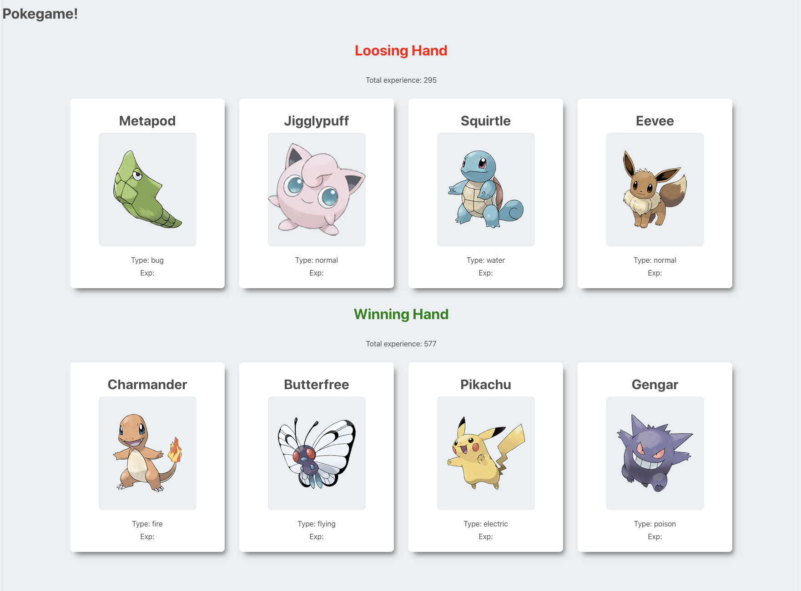

# Pokedex (The Modern React Bootcamp by Colt Steel)

This is a solution to the challenge from The Modern React Bootcamp by Colt Steel. This is my first single page app created using React.

## Table of contents

-   [Overview](#overview)
    -   [The challenge](#the-challenge)
    -   [Screenshot](#screenshot)
    -   [Links](#links)
-   [My process](#my-process)
    -   [Built with](#built-with)
    -   [What I learned](#what-i-learned)
-   [Author](#author)

## Overview

### The challenge

The app is randomly picking up 4 Pokemons for each player (when the page is resfreshed) and based on calculating the total amount of experience in each team displays the winner.

### Screenshot

### Links

## My process

### Built with

-   React
-   Create React App
-   JSX
-   CSS
-   HTML5

### What I learned

With this challenge I had a chance to grasp basic concepts of React and JSX.

## Author

-   Github - [Axseinga](https://github.com/axseinga)
-   Frontend Mentor - [@Axseinga](https://www.frontendmentor.io/profile/axseinga)
-   LinkedIn - [@Agnieszka Urbanowicz](https://www.linkedin.com/in/agnieszka-urbanowicz-051147151/)
